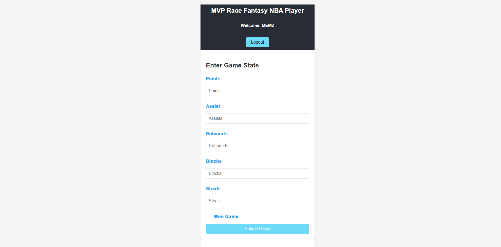

# MVP Race Fantasy NBA Player App



The MVP Race Fantasy NBA Player App is a React and TypeScript-based web application designed to help users track player statistics, career highs, and season summaries for fantasy NBA gameplay. This app is built with Vite for fast development and includes support for ESLint to maintain code quality.

## Features

### User Management

- **Login and Registration**: Users can create an account and log in to track their personal stats.
- **Local Storage**: User data, game stats, and session information are securely stored in the browser's local storage.

### Game Tracking

- **Add Game Stats**: Users can log individual game statistics, including points, assists, rebounds, blocks, steals, and whether the game was won.
- **View Game History**: Displays all logged games or the most recent four games, allowing users to toggle between views.

### Statistical Analysis

- **Career Highs**: Automatically calculates the highest recorded stats for points, assists, rebounds, blocks, and steals.
- **Season Summary**: Tracks the number of wins and losses, calculates win percentage, and provides averages for key stats.
- **Totals**: Displays cumulative totals for all logged stats, helping users see their overall performance.

## Technologies Used

- **React**: For building the user interface.
- **TypeScript**: Ensures type safety and robust code.
- **Vite**: A modern build tool that delivers fast development and hot module replacement (HMR).
- **CSS**: Custom styling to enhance the user experience.

## Getting Started

### Prerequisites

Ensure you have the following installed:

- [Node.js](https://nodejs.org/) (v14 or later)
- [npm](https://www.npmjs.com/) or [yarn](https://yarnpkg.com/)

### Installation

1. Clone the repository:
   ```bash
   git clone <repository-url>
   ```
2. Navigate to the project directory:
   ```bash
   cd mvp-race-fantasy-nba-player-app
   ```
3. Install dependencies:
   ```bash
   npm install
   ```

### Running the App

Start the development server:

```bash
npm run dev
```

Open your browser and visit `http://localhost:3000` to access the app.

### Building for Production

To create a production build:

```bash
npm run build
```

The production-ready files will be available in the `dist` directory.

## ESLint Configuration

The app uses ESLint to ensure consistent code quality and styling. The following configurations are applied:

- **TypeScript Aware Rules**: Enabled type-aware linting by specifying `parserOptions`.
- **React Plugin**: Includes recommended rules from the `eslint-plugin-react`.

To further customize the ESLint setup, refer to the following example:

```js
export default tseslint.config({
  languageOptions: {
    parserOptions: {
      project: ['./tsconfig.node.json', './tsconfig.app.json'],
      tsconfigRootDir: import.meta.dirname,
    },
  },
  settings: { react: { version: '18.3' } },
  plugins: {
    react,
  },
  rules: {
    ...react.configs.recommended.rules,
    ...react.configs['jsx-runtime'].rules,
  },
})
```

## Future Enhancements

- Integration with external APIs for real-time NBA statistics.
- Improved user authentication with secure session management.
- Responsive design for better mobile support.
- Additional features for tracking advanced stats and player comparisons.

## Contributing

We welcome contributions! Please fork the repository and submit a pull request with your changes.

## License

This project is licensed under the MIT License. See the `LICENSE` file for details.

---

Enjoy tracking your fantasy NBA stats with the MVP Race Fantasy NBA Player App!

## See the site here: [NBA stats](https://nba-stats-app-memz.netlify.app/)
